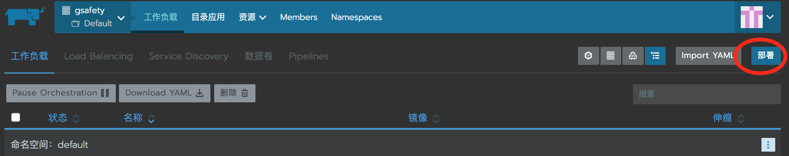
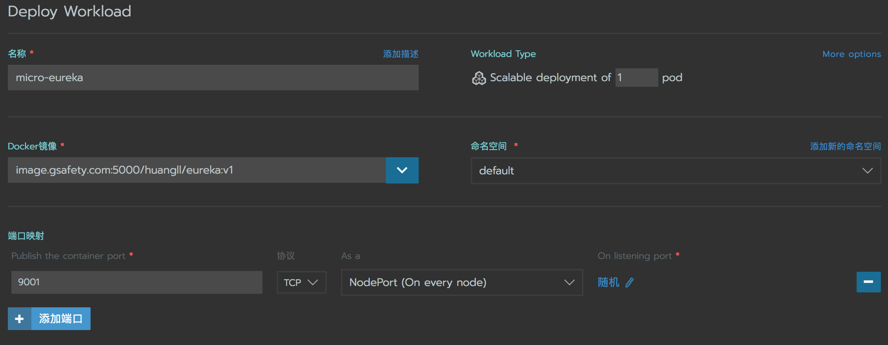
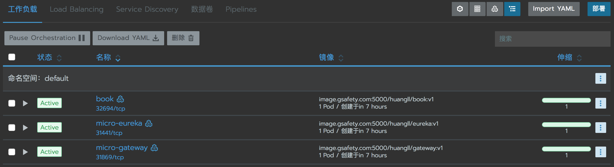
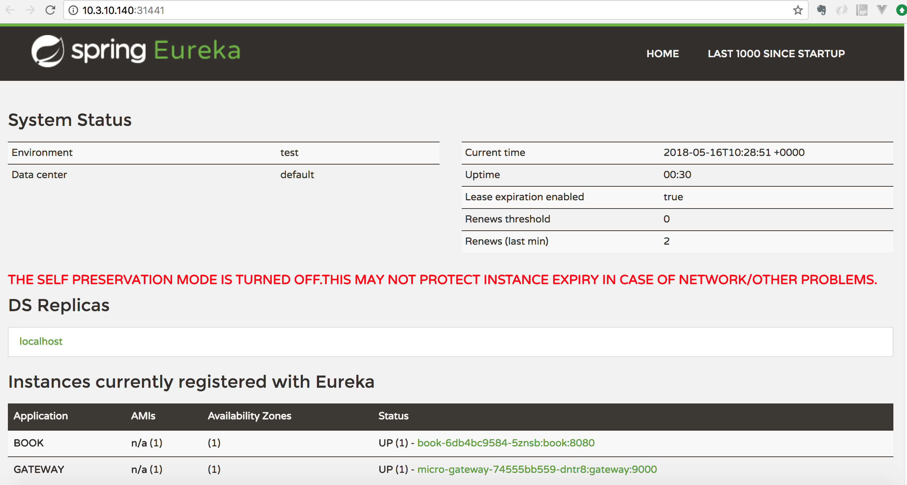
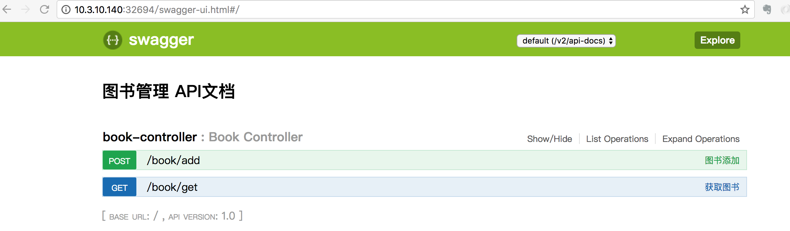
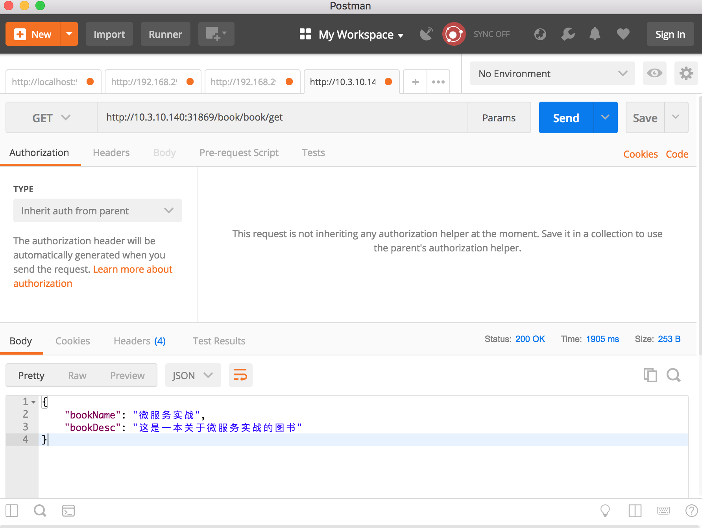

## 基于rancher部署Spring-cloud微服务系统

### 开发微服务系统

基于spring-cloud开发微服务系统，做为演示，开发了注册中心micro-eureka，网关服务micro-gateway，图书管理服务micro-book.


### 搭建docker 镜像注册中心

运行下列命令部署镜像仓库：

```shell
 docker run -d -p 5000:5000 -v /myregistry:/var/lib/registry registry:2
```

配置hosts:

```
10.3.10.140 image.gsafety.com
```

### 构建镜像

 将jar包和对应的Dockerfile放在如下的目录：

```
/app
├── book
│   ├── Dockerfile
│   └── micro-book-1.0.jar
├── eureka
│   ├── Dockerfile
│   └── micro-eureka-1.0.jar
└── gateway
    ├── Dockerfile
    └── micro-gateway-1.0.jar
```

Dockerfile示例：

```dockerfile
FROM java:8-jre
MAINTAINER huangll99@126.com
ADD micro-eureka-1.0.jar /app.jar
EXPOSE 9001
ENTRYPOINT ["/usr/bin/java","-jar","app.jar"]
```

构建命令示例，在eureka目录下执行

```shell
docker build -t huangll/eureka:v1 .
```

给生成的镜像打标签

```
docker tag huangll/eureka:v1 image.gsafety.com:5000/huangll/eureka:v1
```

将镜像push到镜像仓库

```
docker push image.gsafety.com:5000/huangll/eureka:v1
```

### 部署服务

- 在rancher项目页面点击部署

  

- 填写部署名称，镜像名称，映射端口，点击启动

  

- 部署后在工作负载页面查询部署的三个服务

  

 ### 访问服务

- 访问eureka注册中心 http://10.3.10.140:31441/

  

- 访问图书管理服务的swagger文档 http://10.3.10.140:32694/swagger-ui.html#/

  

- 使用postman通过网关调用图书管理服务

  


